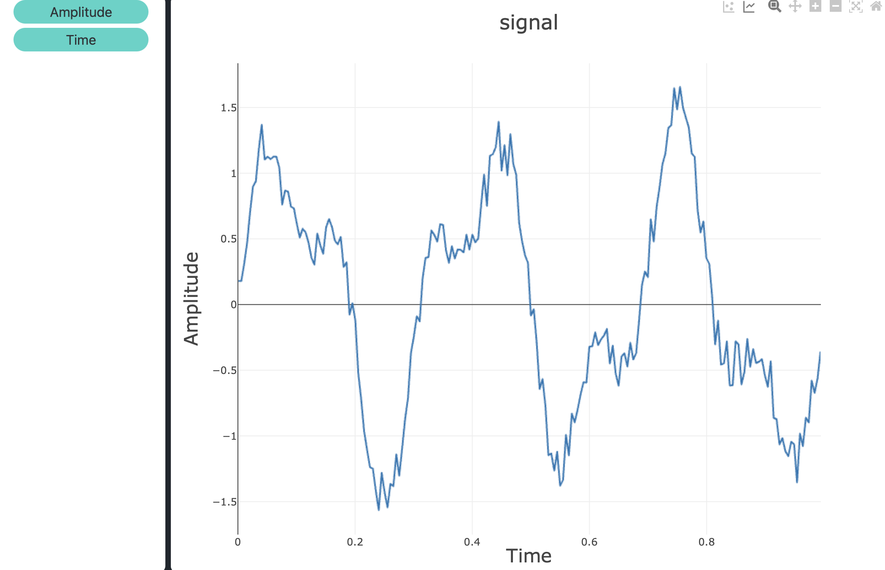
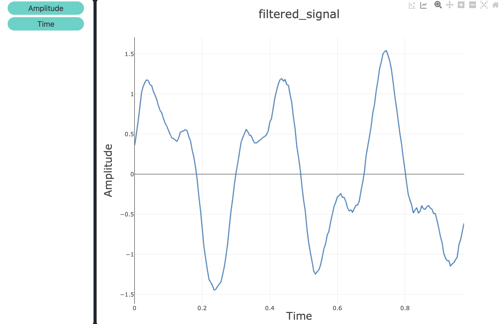
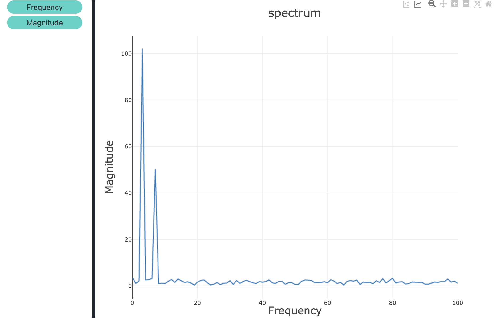
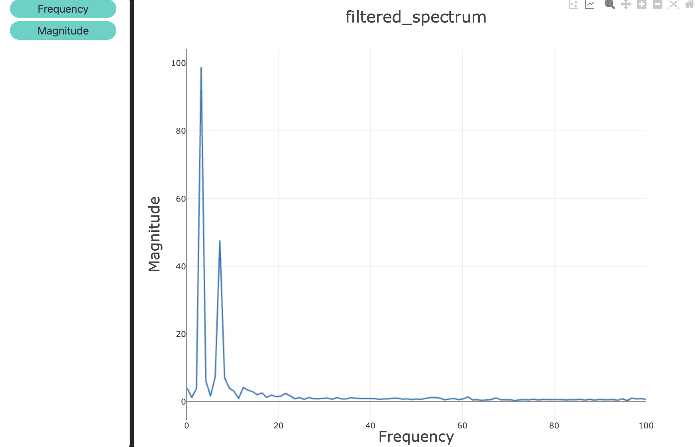

# DSP Spectrum Analyzer

This is a small C++ project I made to practice basic digital signal processing concepts like sampling, filtering and the Fourier transform.

## What it does

The program first generates two sine waves, one at 3 Hz with amplitude 1.0 and one at 7 Hz with amplitude 0.5. Both are 1 second long and sampled at 200 Hz. The two signals are added together and then random noise (between -0.2 and +0.2) is added on top, so the result looks more like a real measured signal.

To clean the noise a simple moving average filter with window size 5 is applied. After that the program computes the DFT of both the noisy and the filtered signal to see the frequency content. Finally it searches for the biggest peak in the filtered spectrum and prints the peak frequency, which should come out around 3 Hz since that is the strongest component.

## Files

- `main.cpp` - runs the whole demo and writes the csv files
- `SignalGenerator.h / .cpp` - class with all the signal functions (sine, square, noise, moving average, DFT, peak detection)

## Build and run

```
g++ -std=c++11 main.cpp SignalGenerator.cpp -o spectrum_analyzer
```

```
./spectrum_analyzer
```

## Output

The program prints the sample rate, number of samples, peak frequency and peak magnitude to the console. It also creates 4 csv files:

- `signal.csv` - the noisy signal (time / amplitude)
- `filtered_signal.csv` - the signal after the moving average
- `spectrum.csv` - DFT magnitude of the noisy signal (frequency / magnitude)
- `filtered_spectrum.csv` - DFT magnitude of the filtered signal

## Plots

I plotted the csv files with csvplot.com

Noisy signal:



Filtered signal, the noise is visibly reduced:



Spectrum of the noisy signal, you can clearly see the two peaks at 3 Hz and 7 Hz:



Spectrum of the filtered signal:


